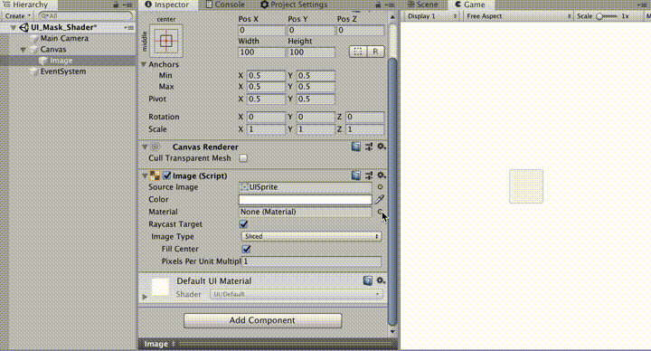

# mask\_color\_shader

## What

uGUI shader for creating single color mask.



## Install

```shell
yarn add "umm/mask_color_shaders#^1.0.0"
```

## Examples

See [Assets/Examples](./Assets/Examples) folder

## License

Copyright (c) 2019 Takuma Maruyama

Released under the MIT license, see [LICENSE.txt](LICENSE.txt)

